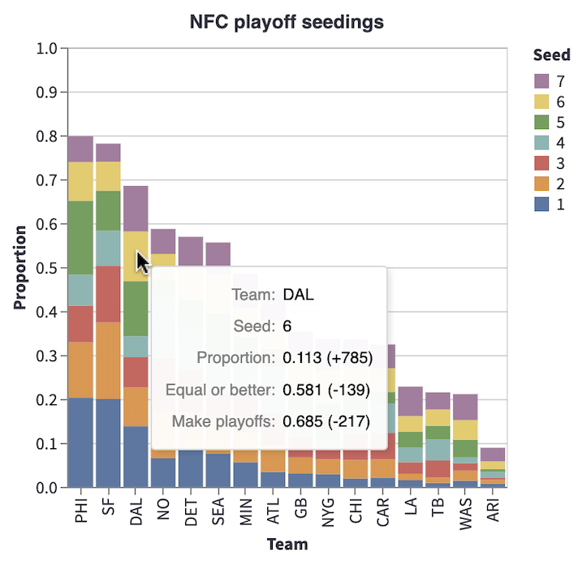
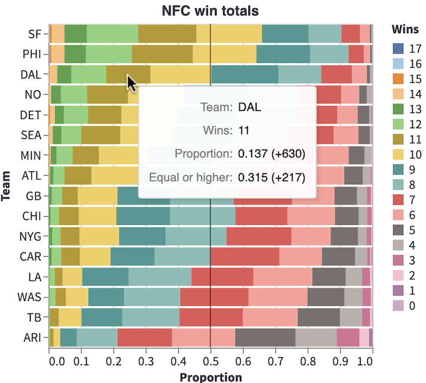
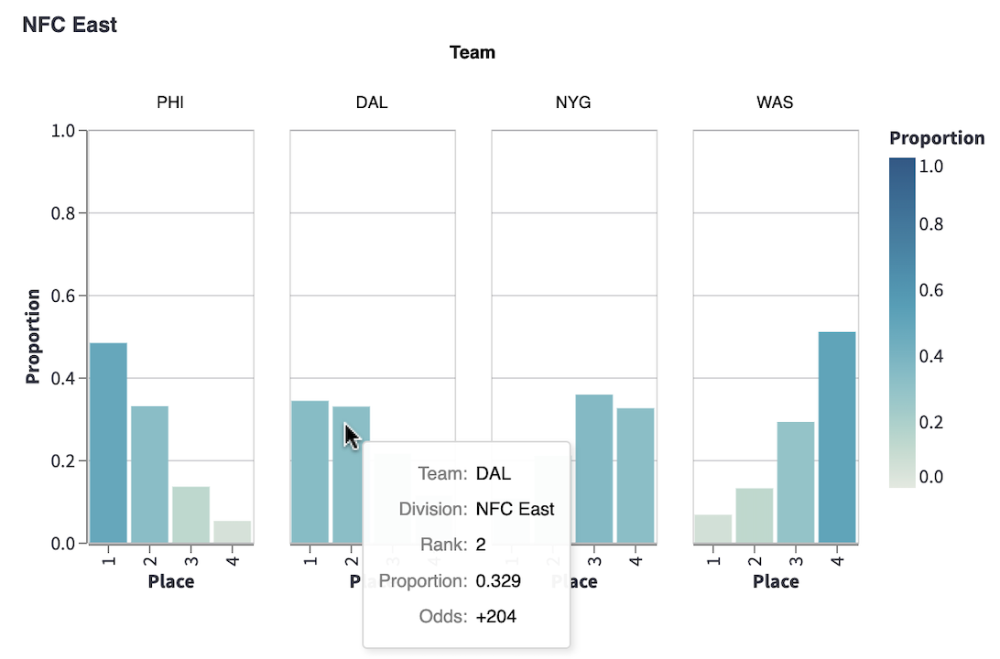

# NFL2021-Simulation
 
You can set your own power ratings for each team, and then simulate the 2021 NFL season.  Try the app on [Streamlit](https://share.streamlit.io/christopherdavisuci/nfl2021-simulation/main/nfl_sim_app.py) or test out some related code on [Deepnote](https://deepnote.com/project/NFL-2021-Simulation-XVJzHB7aTvGndVBV4CLYOA/%2FNFL2021-Simulation%2Fnfl_sim_byes.ipynb).

</img>
</img>
</img>
